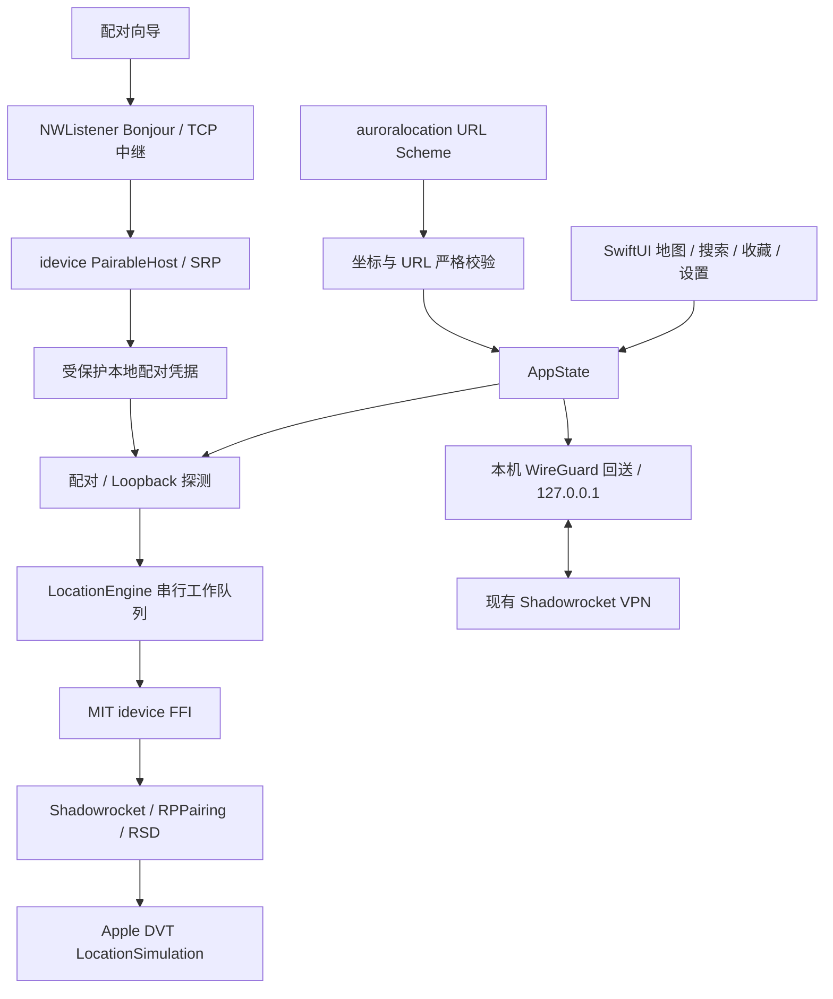

# Aurora Location 架构

- `App/`: 单一 UI 状态与操作互斥. Pairing 和 DVT 不并发运行. URL Scheme 与按钮使用同一校验和前置条件.
- `Core/`: Network 探测、配对广播/取消、DVT 串行 FFI. 不从错误中回显底层消息, 防止 peer 数据进入诊断.
- `Storage/`: 配对凭据与收藏/历史分别保存. Application Support 目录 Complete Protection + backup exclusion. 写入使用 atomic + completeFileProtection. 读取损坏时不以空数据覆盖文件.
- `Models/`: 有限经纬度校验, 严格 URL parser, UUID/时间戳收藏. 最近使用去重并保留 20 项.
- `Features/`: 原生地图与可访问的手工坐标入口. 搜索请求和反向解析取消旧结果. 恢复按钮固定在底部.
- `Vendor/idevice/`: 固定源码版本和最小 patch 的静态库, 记录构建和许可材料.
- `Vendor/emproxy/`: 使用 BSD-3-Clause boringtun 的项目自有最小回送实现. 不链接 AGPL EMProxy. 仅监听 localhost, 限制配对端口并检查 IPv4/TCP 包.

## 状态与失败

App 每次启动显示状态未知. `最近操作` 是命令记录, 不等同于系统仍处于模拟定位. set 成功保留 DVT 会话及中继, 换点复用; clear 或失败时按依赖顺序释放, 下次重新连接. 保留的指针不是实时健康证明, 每次指令错误仍会使会话失效. 没有模拟会话时的检测结束即释放; 模拟期间点击检测不会拆除已有会话.

没有 pairing 时引导配对. 首次 Bonjour 配对要求 Wi-Fi; 已配对设备按实际 loopback 和开发者握手结果判断, 不用 Wi-Fi 接口拦截蜂窝网络. 开发者服务错误提示检查 Developer Mode/DDI, 不伪造确定根因. 所有远程调用需有超时, pairing 取消后要等底层 worker 真正退出才能重试.

## 后台与隐私

没有固定位置重发、GPS 后台 keep-alive、静音音频、analytics、账号或服务器. 配对期间临时展示 PIN 并通过本地通知帮助用户在系统设置中输入, 完成/取消后清除通知. 配对记录不进入日志、Git、剪贴板或诊断. MapKit 搜索和反向地理编码使用 Apple 服务, 会向 Apple 请求地点信息; 不宣称这些网络功能完全离线.

## 单 VPN 验证

用户已明确不安装第二个 VPN, 保持 Shadowrocket 全天连接. 因此当前实现不增加 `NEPacketTunnelProvider`, 通过 App 内本机中继验证既有小火箭的 loopback 行为. 具体证据、候选连接参数和验收边界见 [SHADOWROCKET.md](SHADOWROCKET.md). 未通过真机 DVT set/clear 前不宣称该路径兼容.
