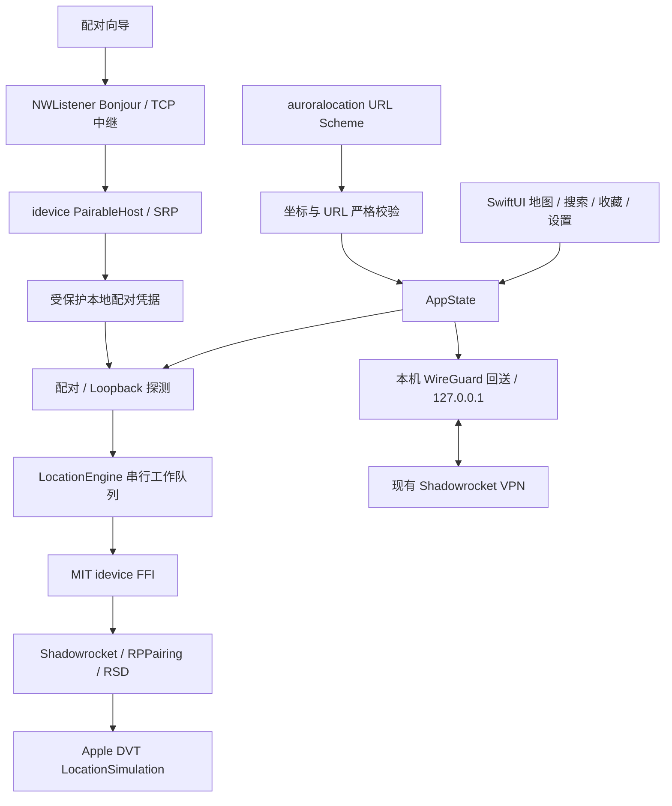

# Aurora Location 架构

- `App/`: 单一 UI 状态与操作互斥. Pairing 和 DVT 不并发运行. URL Scheme 与按钮使用同一校验和前置条件.
- `Core/`: Network 探测、配对广播/取消、DVT 串行 FFI. 不从错误中回显底层消息, 防止 peer 数据进入诊断.
- `Storage/`: 配对凭据与收藏/历史分别保存. Application Support 目录 Complete Protection + backup exclusion. 写入使用 atomic + completeFileProtection. 读取损坏时不以空数据覆盖文件.
- `Models/`: 有限经纬度校验, 严格 URL parser, UUID/时间戳收藏. 最近使用去重并保留 20 项.
- `Features/`: 原生地图与可访问的手工坐标入口. 搜索请求和反向解析取消旧结果. 恢复按钮固定在底部.
- `Vendor/idevice/`: 固定源码版本和最小 patch 的静态库, 记录构建和许可材料.
- `Vendor/emproxy/`: 使用 BSD-3-Clause boringtun 的项目自有最小回送实现. 不链接 AGPL EMProxy. 仅监听 localhost, 限制配对端口并检查 IPv4/TCP 包.

## 状态与失败

App 每次启动显示状态未知. `最近操作` 是命令记录, 不等同于系统仍处于模拟定位. set 成功保留 DVT 会话及中继, 换点复用; clear 或失败时按依赖顺序释放, 下次重新连接. 保留的指针不是实时健康证明, 每次指令错误仍会使会话失效. 没有模拟会话时的检测结束即释放; 模拟期间点击检测不会拆除已有会话.

没有 pairing 时引导配对. 首次 Bonjour 配对要求 Wi-Fi; 已配对设备按实际 loopback 和开发者握手结果判断, 不用 Wi-Fi 接口拦截蜂窝网络. 开发者服务错误提示检查 Developer Mode/DDI, 不伪造确定根因. 所有远程调用需有超时, pairing 取消后要等底层 worker 真正退出才能重试.

## 后台与隐私

单一维护任务负责定点保持和步行, 定点/暂停/到达约每 4 秒重发, 步行约每秒按实际经过时间沿路线插值. 指令成功后才发布进度, 超过 8 秒的步行执行间隔中断且不追赶跳点. clear 或失败停止任务. 可选 Core Location 后台监测沿用现有权限设置, 不保证系统挂起后执行.

定点和步行分别使用独立标签页, 起终点用独立选择弹窗. WalkingRoute 保存步行折线及来源, WalkingSession 负责距离和暂停/恢复/到达状态; AppState 调度现有 DVT 会话. 没有静音音频、analytics、账号或自建服务器. 配对期间临时展示 PIN 并通过本地通知帮助用户在系统设置中输入, 完成/取消后清除通知. 配对记录不进入日志、Git、剪贴板或诊断. MapKit 搜索、路线规划和反向地理编码使用 Apple 服务, 备选路线使用 FOSSGIS 服务, 不宣称完全离线.

## 自动步行路线服务

MapKit 服务失败或未找到路线时自动尝试 FOSSGIS 的独立 OSRM foot 实例. 专用 HTTP 服务层使用 URLSession, 校验响应状态、GeoJSON LineString、坐标范围和端点吸附距离, 不将驾车路线改名为步行路线. 取消请求或变更端点后不发布旧结果. 页面说明第三方起终点传输与日志政策并显示数据署名. 2026-09-16 真机 MapKit 对纽约明确返回 OUT_OF_COVERAGE, 北京成功; 系统 Apple Maps 成功不代表第三方 MKDirections 使用相同服务覆盖.

## 单 VPN 验证

默认连接通过 App 内本机中继使用既有 Shadowrocket, 不增加 `NEPacketTunnelProvider`. 具体证据、候选连接参数和验收边界见 [SHADOWROCKET.md](SHADOWROCKET.md). 未通过真机 DVT set/clear 前不宣称该路径兼容.

## Personal VPN 共存实验

定位和 IKEv2 只保留一个 App 入口, 共用 AppState. 定点/步行标签不变, IKEv2 位于设置的独立页面. Bundle ID 沿用原 IKEv2Lab 以保留系统 VPN 配置和 Keychain; 旧主 App 的文件容器需单独迁移, 不能将相同 Keychain service 名称视为跨 App 共享.

设置页的独立蜂窝连接实验入口使用 `NEVPNManager` 管理原生 IKEv2 Personal VPN, 需要独立的 IKEv2 服务端和带 Personal VPN 能力的签名. Apple 支持 Personal VPN 与一个 enterprise VPN 同时连接, 但这不证明 Shadowrocket 的开发者连接会改变蜂窝属性或能够修改定位.

只管理本 App 的 IKEv2 配置, 不管理 Shadowrocket 配置. 使用系统服务器证书验证和 EAP 用户名/密码, 密码保存在本机 Keychain, 通过 persistent reference 交给系统. 不启用 On Demand, 不设置 includeAllNetworks. 定位或配对进行中禁止从实验页调整 VPN. 新页面不会自动创建配置或启动 VPN.
